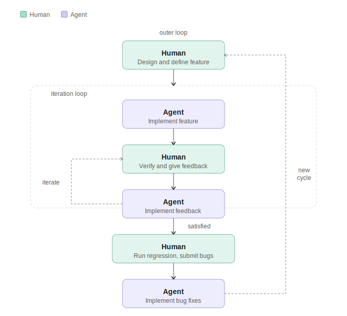
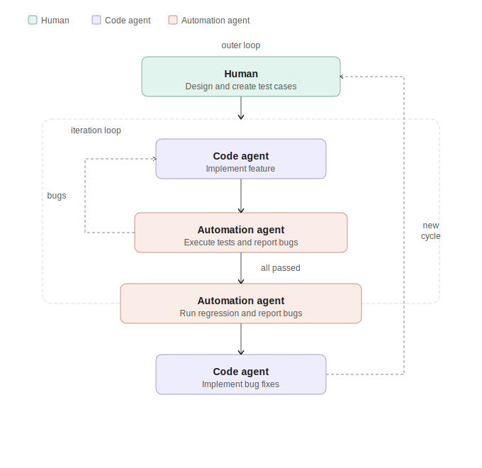
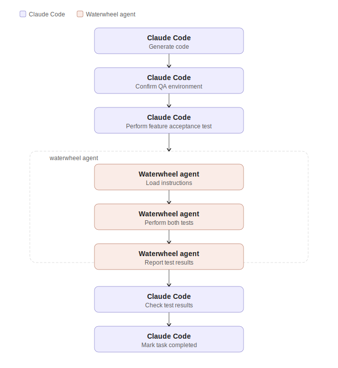
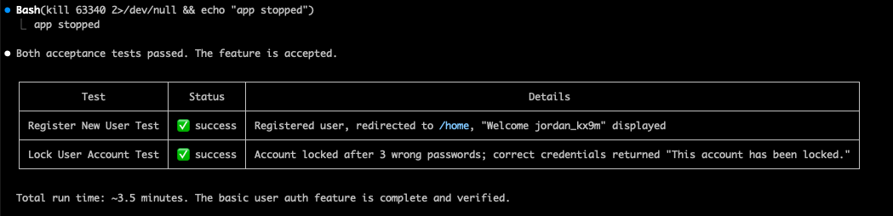
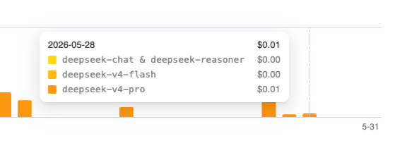

# Demo Project of Test Driven Development (TDD) with AI

This repository includes a sample project that demonstrates how to combine `waterwheel-agent` and `claude-code` to perform Test Driven Development (TDD) tasks without human supervision.

## Concepts
Current vibe coding practices heavily rely on human verification to safeguard product quality, which is neither reliable nor efficient. As AI coding capabilities continue to advance, the manual QA process is overwhelmed by the breakneck speed of feature development and eventually becomes both a bottleneck and a breaking point.



To address such an imbalance, automating the QA process becomes inevitable. To make QA automation effective, I propose adopting Test Driven Development as the new development paradigm.



## Initial Structure
The project's initial structure is saved in the [initial_structure branch](https://github.com/taodong/tdd-demo/tree/initial_structure), which contains only text files to lay out the design requirements and agent instructions.

- **CLAUDE.md**: A file used to provide guidance for initializing `claude-code`. In addition to project principles, it defines three skills, `Confirm QA Environment`, `Feature Acceptance Test`, and `Feature Debug`, to enable the inner `bugs` loop between the `Code agent` and `Automation agent`.
- **features/1-basic-user-auth.md**: The desired feature design requirements.
- **tests**: A folder that contains two chained tests to verify that the desired feature is implemented.
- **outputs**: A folder that stores test results from the `Waterwheel agent`. The `readme.txt` inside is used to satisfy Git folder check-in requirements.
- **waterwheel-instructions**: A folder containing all instructions for the `Waterwheel agent`. Please see the `Agents` section for how these files are used.


## Agents
Two agents are used for this demo:
1. **Claude Code**: acting as Code agent in this demo.
2. **Waterwheel Test Agent**: acting as Automation agent in this demo. [Tool Page](https://waterwheel.duotail.com)

### Waterwheel Configuration
Our local Waterwheel agent is configured to use `DeepSeek` as its AI provider to reduce costs. Its volume mappings are defined as follows:
```yaml
 # Local instructions (where you put your yaml files)
- ${PROJECT_PATH}/waterwheel-instructions:/agent/instructions:ro

# Task input/output folders
- ${PROJECT_PATH}/tests:/agent/tasks:ro
- ${PROJECT_PATH}/outputs:/agent/outputs:rw

# Global prompt
- ${PROJECT_PATH}/waterwheel-instructions/system-prompt-cn.md:/agent/config/system.prompt.md:ro
```
The purpose of the files under `waterwheel-instructions` is:
- **allowed-domains.yaml**: Grants permission for the `waterwheel agent` to access the page that `claude-code` uses to deploy the website.
- **extra-instruction.md**: Since the test website is deployed to localhost, extra instructions are needed to help the `waterwheel agent` Docker container access the host machine browser.
- **global-context.json**: Defines the test URL as a global variable, so tests can be executed as regression tests in different environments without modification.
- **system-prompt-cn.md**: Needed only when the agent is configured for token-efficiency mode while using `DeepSeek`.

## Process
After `claude-code` initialized the project using `CLAUDE.md`, we granted it all required permissions and asked it to complete the tasks defined in `1-basic-user-auth.md`. Both agents worked hand in hand and completed the following tasks without any human intervention.



> You can check out the `initial_structure` branch to try the whole process yourself.

## Results and Costs

The final result reported by `claude-code` is shown below:



The total cost accumulated by `waterwheel-agent` is **$0.01**.



## Run The Application
You can try the final demo application by running `mvn spring-boot:run`. The web page will be deployed locally at `http://localhost:8080`.

